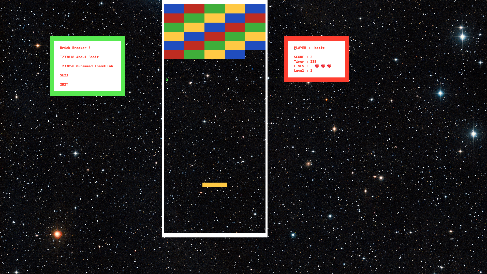
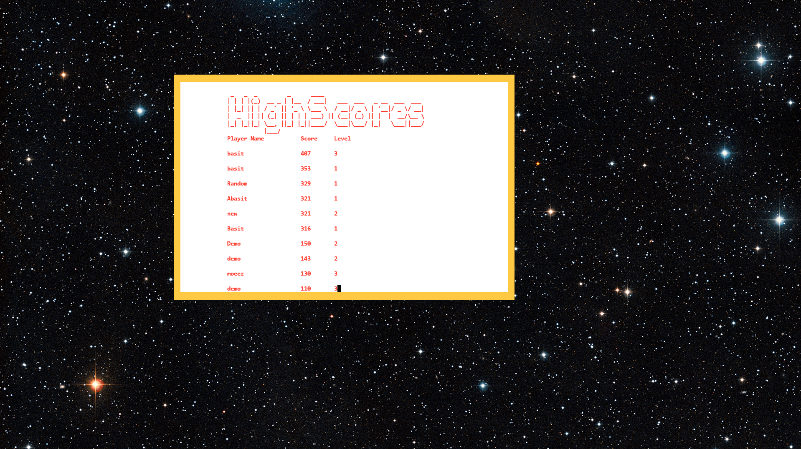
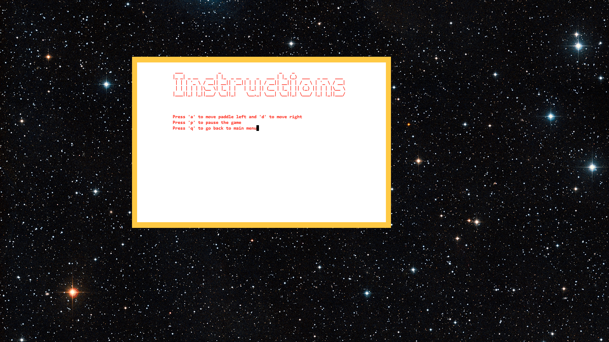

# Brick Breaker (MASM x86 Assembly)

## Project Overview
For our Computer Organization and Assembly Language (COAL) project, we developed a classic **Brick Breaker** game in **MASM x86 Assembly**, utilizing the `irvine32` library for graphics/input and `winmm` for sound effects.

---

## Features

- **Three Levels**: Players progress through three increasing levels of difficulty.
- **File Handling**: The game reads and writes to three separate files for highscores:
  - `name.txt`: Stores player names.
  - `level.bin`: Tracks the current level.
  - `score.bin`: Records player scores.
- **Sound Effects**:
  - Background music plays during gameplay.
  - Brick-breaking sound effects enhance the experience.

---

## Gameplay

---

## High Scores & Game Over

| High Scores | Game Over |
|-------------|------------|
|  |  |

---

## Instructions

---

## Requirements

- MASM x86 Assembly
- Irvine32 Library
- `winmm.lib` (Windows Multimedia Library)
- Windows OS (for compatibility with `winmm` functions)

---

## Installation & Setup

1. Install MASM and the Irvine32 library.
2. Ensure `winmm.lib` is available in your linker settings.
3. Link your solution with `irvine32.lib` (provided in files).
4. Run the executable to start playing.

---

## Controls

- **A**: Move paddle left  
- **D**: Move paddle right  
- **W**: Navigate Up (in menu)  
- **S**: Navigate Down (in menu)  
- **Enter**: Start game  
- **P**: Pause game

---

## Contributors

- **Abdul Basit** – Roll Number: 23i3018  
- **Muhammad Inamullah** – Roll Number: 23i-3058

---

## Notes

- Ensure required files (`name.txt`, `level.txt`, `score.txt`) are in the same directory as the executable.
- A video demo is provided for setup and gameplay.
- Feel free to reach out for any questions!

---

> Enjoy breaking bricks! 🚀
